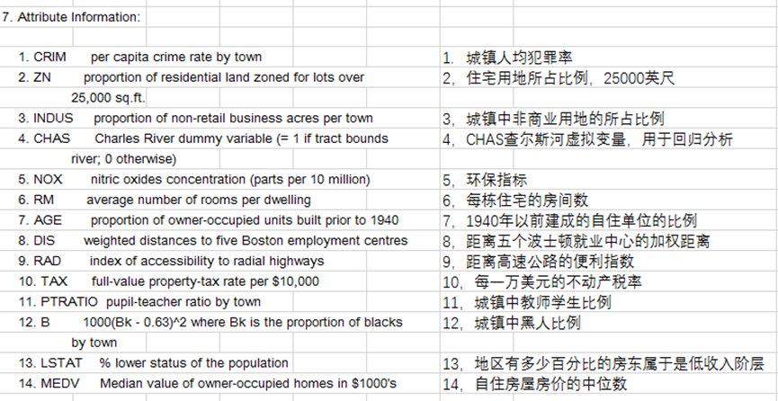
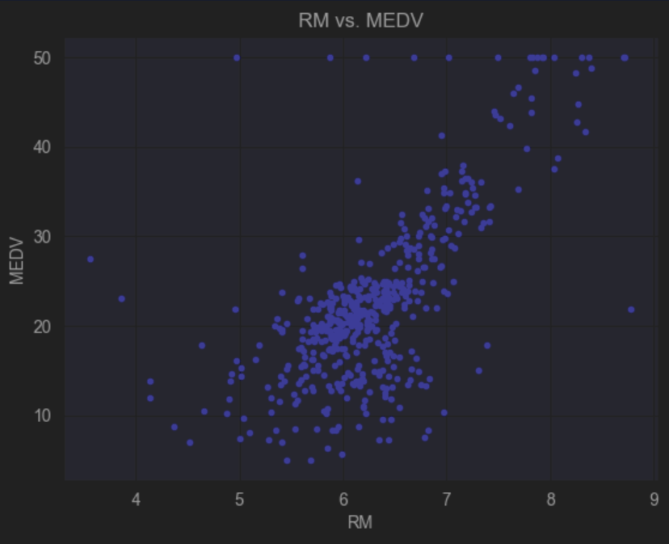
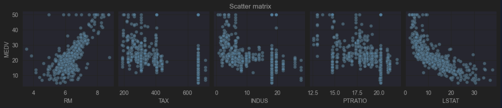
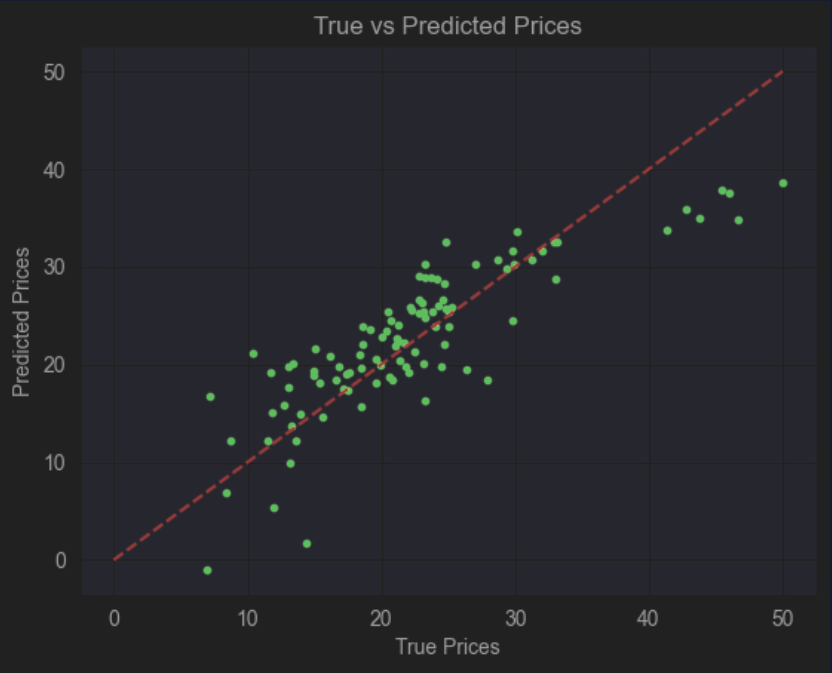
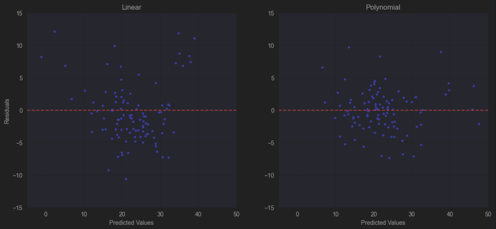

# Boston House Price Prediction


机器学习项目，使用波士顿房价数据集进行房价预测分析。

## 项目背景
正在学习 **机器学习**，最开始接触的是线性回归和多项式回归，因此选择了经典的 **波士顿房价预测** 作为项目练习。

## 项目结构
```plaintext
boston_houseprice/
├── housing.csv # 数据集
├── img/ # 项目图片
├── Forecasts.ipynb # 主要分析代码
└── README.md # 项目说明
```

## 项目描述
该项目使用 **线性回归模型 (含梯度下降)** 和 **多项式回归模型** ，采用 **RMSE**、**R2** 和 **交叉验证** 多种模型评估方式进行验证。



## 功能特性
- 数据探索性分析
- 特征工程处理
- 多种回归模型比较（线性回归 / 多项式回归）
- 模型评估与可视化
- 房价预测结果展示

## 项目结论
通过预测波士顿房价，可以得出 **RM**, **TAX**, **INDUS**, **PTRATIO**, **LSTAT** 这五种特征值对房价具有一定的影响。

最终采用的多项式回归模型拟合效果最好，**RMSE = 7%**，**R2 = 85.5%**。

## 示例结果

---

***房间数与房价散点图***

<div align="center">
    
</div>

---

***相关性大于 0.45 的特征值与房价散点矩阵图***



---

***真实值和预测值散点图***

<div align="center">
    
</div>

---

***线性回归与多项式回归散点比较图***



---

## 缺陷
- 模型构建较为生疏，代码较为粗糙
- 思考过程可能未涉及全面
- 可视化部分较少，可能影响观察和判断

## 免费资源链接
- [Github](https://github.com/Themilkyway01/Boston_Houseprice)
- [GitCode](https://gitcode.com/Galaxy_zero/boston_houseprice)
